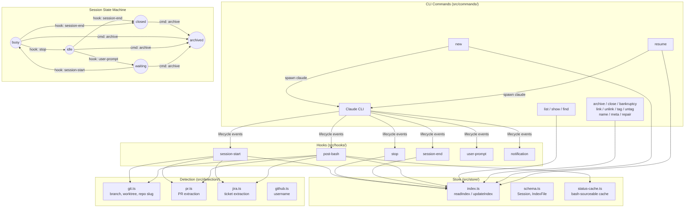

# c - Claude Code Session Manager

## Build
npm run build

Output: `dist/` (mirrors `src/` structure). Config: `tsconfig.json`. No bundler — just `tsc`.

Rebuild after moving changes onto main (merge, cherry-pick, rebase) so the global `c` binary reflects the new code.

## Run

- **Repo root:** `c <command>` runs the built `dist/index.js` via the global symlink. Requires a build first.
- **Repo root (dev):** `c-dev [--] [args]` runs source directly via `tsx` — no build needed.
- **Worktree:** `c-dev <worktree-name> [--] [args]` runs worktree source via `tsx` — no build needed.

## Architecture
- Hooks in `src/hooks/` handle Claude Code lifecycle events
- Session state stored via `src/store/`



### Data flow
- **Hooks → Detection → Store**: Claude lifecycle events trigger hooks, which use detection utilities to discover git branches, PRs, and JIRA tickets, then persist state to the index and status cache.
- **Commands → Store → Format**: CLI commands read from the index, format output via `src/util/format.ts`, and display to the user.

## Testing

### Strategy
- **Framework**: Node.js built-in `node:test` with `node:assert`
- **Run all tests**: `npm test` (or `node --experimental-strip-types --test test/**/*.test.ts`)
- **Run one file**: `node --experimental-strip-types --test test/commands/file.test.ts`
  - Files using `mock.module()` also need `--experimental-test-module-mocks`
- **Test style**: Behavioral, end-to-end through the CLI. Seed state via `cli.seed()`, run the real command via `cli.run()`, assert outcomes on store and output. Do not reimplement command logic in tests.
- **Placement**: Group tests by command (`test/commands/`) or module (`test/claude/`, `test/hooks/`). Add cases to an existing file when the behavior fits its scope.

### Command tests
Command tests use `test/helpers/cli.ts` to run commands through `createProgram().parseAsync()`. This exercises argument parsing, store persistence, output formatting, and error handling end-to-end.

```ts
import { setupCLI } from '../helpers/cli.ts';

let cli: CLIHarness;
beforeEach(() => { cli = setupCLI(); });
afterEach(() => { cli.cleanup(); });

it('does something', async () => {
  await cli.seed({ id: 's1', state: 'busy' });   // populate store
  await cli.run('command', '--flag', 'arg');       // run through Commander
  const s = cli.session('s1');                     // assert store state
  assert.ok(cli.console.logs.some(l => l.includes('expected output')));
});
```

- **Do not** reimplement command logic inline (pushing to arrays, setting state, filtering) — run the real command.
- Seed sessions via `cli.seed()`, assert store state via `cli.session()` / `cli.index()`.
- Assert console output via `cli.console.logs` / `cli.console.errors`, stdout via `cli.stdout.output`, exit codes via `cli.exit.exitCode`.

### Asserting JSON output

For commands that support `--json`, extract the seed to a variable and assert the full output with `deepStrictEqual`. This pins the JSON contract — any field added, removed, or renamed breaks the test.

```ts
it('JSON matches seeded session', async () => {
  const t = new Date('2025-06-01T12:00:00Z');
  const seed = {
    id: 's1', state: 'busy' as const, name: 'Test',
    directory: '/home/u/proj',
    created_at: t, last_active_at: t,
    resources: { branch: 'main' },
    tags: ['wip'],
    meta: { priority: 'high' },
  };
  await cli.seed(seed);
  await cli.run('list', '--json');

  assert.deepStrictEqual(JSON.parse(cli.stdout.output.join('')), [{
    ...seed,
    project_key: '-home-test-project',
    created_at: t.toISOString(),
    last_active_at: t.toISOString(),
    tags: { values: seed.tags },
  }]);
});
```

Three transformations between seed and expected output:
1. **Dates**: `Date` objects → `.toISOString()` strings
2. **Tags**: `string[]` → `{ values: string[] }`
3. **Defaults**: `project_key` auto-filled as `'-home-test-project'` by `createTestSession`

Fields not in the seed use `createTestSession` defaults — include them explicitly (`directory: '/home/test/project'`, `state: 'busy'`, `resources: {}`, `servers: {}`, `tags: { values: [] }`, `meta: {}`).

- Use `deepStrictEqual` over field-by-field `strictEqual` — it catches both missing and unexpected fields.
- Use fixed dates (`new Date('2025-06-01T12:00:00Z')`) so ISO strings are deterministic.
- For multi-item output, match each item individually or assert the full array.
- JSON output goes to `cli.stdout.output` (via `process.stdout.write`), not `cli.console.logs`.

### Commands that access Claude session data
Commands that import from `src/claude/sessions.ts` (e.g. `list`, `repair`) need `mock.module` **before** any imports that pull in that module. Use dynamic imports:

```ts
import { mock } from 'node:test';
import { resolve } from 'node:path';

mock.module(resolve('src/claude/sessions.ts'), {
  namedExports: { getClaudeSession: () => ({ id: 'stub' }), /* ... */ },
});

const { setupCLI } = await import('../helpers/cli.ts');
```

The mock must stub **every** named export from the module — not just those the command under test imports directly. Transitive imports (e.g. `format.ts` imports `getClaudeSessionTitles`) will throw a cryptic `SyntaxError: does not provide an export named '...'` if any export is missing. See `test/commands/repair.test.ts` for the full export list.

### Running individual test files
Files that use `mock.module()` require the experimental flag:
```bash
node --experimental-strip-types --experimental-test-module-mocks --test test/commands/file.test.ts
```
`npx tsx --test` will fail with `mock.module is not a function`.

### Commands that spawn external processes
Commands that exec/spawn (`new`, `resume`, `tmux-pick`) cannot be tested through `parseAsync()`. Test their pre-spawn logic directly as unit tests.

## Known behaviors

### `c new "name"` with existing worktree
When `c new "bugfixes"` is run and a worktree named `bugfixes` already exists, Claude CLI handles the conflict — it either reuses the existing worktree or errors. `c` does not pre-check for worktree name collisions.

### `c new "name"` outside a git repo
Skips `--worktree` and prints a dim warning. The session is created normally without a worktree.

### `c archive` with a running worktree session
Sends SIGINT to the session process (5s timeout), marks the session archived, but does **not** remove the worktree directory. Worktree cleanup is left to the user or `git worktree prune`.

### `--no-worktree` flag
`c new "name" --no-worktree` creates a named session without passing `--worktree` to Claude, even inside a git repo. Useful for sessions that don't need branch isolation.

### `c repair --thorough`
Runs expensive enrichment steps in addition to fast local fixes: title backfill from transcripts, JIRA from branch names, branch for closed sessions, PR from GitHub API (grouped by repo), cost from full transcript. Use `--quiet` to suppress "No issues found" output. `--install-schedule` / `--uninstall-schedule` manage a launchd agent that runs thorough repair every 5 minutes.

## Notes
- `/rename` titles are read directly from Claude's transcript files
- Interactive Claude TUI cannot be tested from within a Claude session — `spawn('claude', ..., { stdio: 'inherit' })` deadlocks on TTY. Use `--print` mode for non-interactive flag/arg testing; test interactive launch from a separate terminal.
