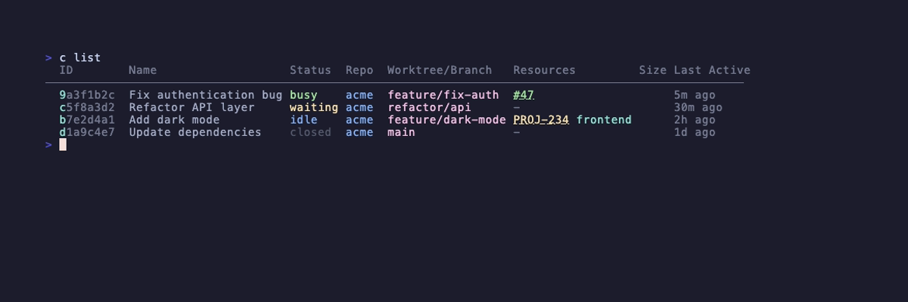
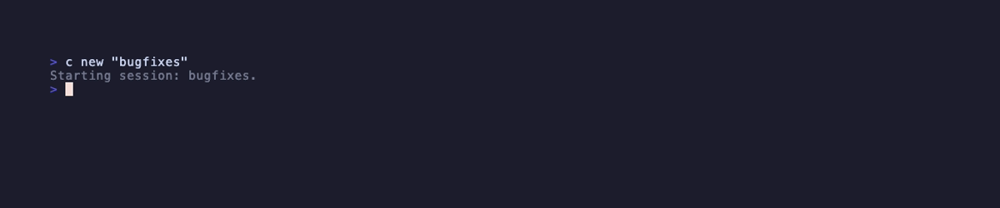
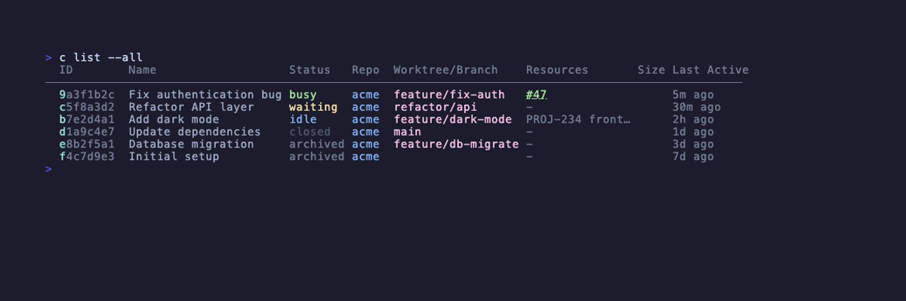
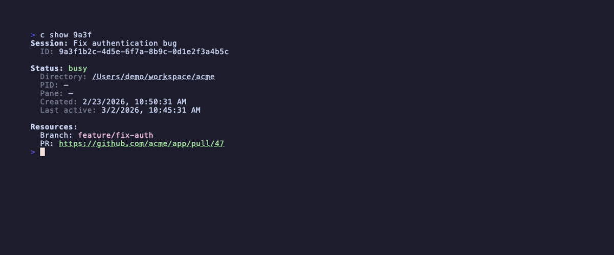
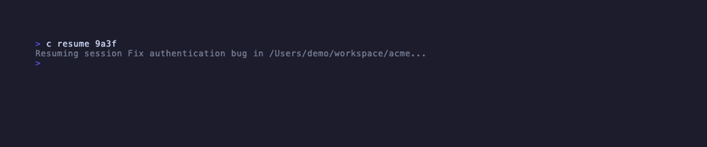
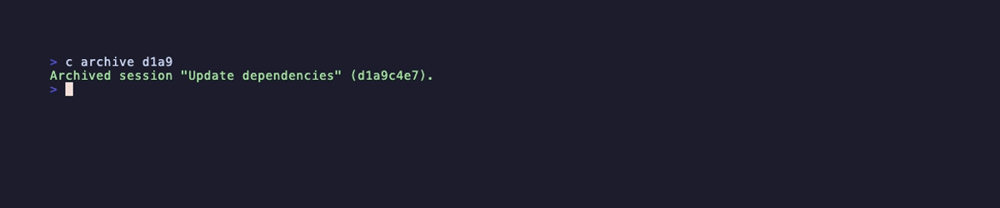

# c

A session manager for [Claude Code](https://docs.anthropic.com/en/docs/claude-code). Claude Code doesn't have built-in session management — once you close a session, finding it again means digging through `~/.claude/projects/`. `c` fixes that by tracking every session with metadata like git branches, PRs, and JIRA tickets, then giving you commands to list, search, resume, and archive them from the terminal.

It works by hooking into Claude Code's lifecycle events. As you work, `c` automatically detects your git branch, linked PRs, and JIRA tickets, keeping your session index up to date without any manual effort.



## Installation

```bash
git clone https://github.com/echo-bravo-yahoo/c.git
cd c
npm install
npm run build
npm link
```

Then add hooks to `~/.claude/settings.json`:

```json
{
  "hooks": {
    "SessionStart": [
      { "hooks": [{ "type": "command", "command": "c hook session-start" }] }
    ],
    "Stop": [
      { "hooks": [{ "type": "command", "command": "c hook stop" }] }
    ],
    "SessionEnd": [
      { "hooks": [{ "type": "command", "command": "c hook session-end" }] }
    ],
    "PostToolUse": [
      {
        "matcher": "Bash",
        "hooks": [{ "type": "command", "command": "c hook post-bash" }]
      }
    ],
    "UserPromptSubmit": [
      { "hooks": [{ "type": "command", "command": "c hook user-prompt" }] }
    ],
    "PreToolUse": [
      {
        "matcher": "AskUserQuestion",
        "hooks": [{ "type": "command", "command": "c hook notification-waiting" }]
      }
    ]
  }
}
```

| Hook | Event | What it does |
|------|-------|--------------|
| `session-start` | Session begins | Registers session, detects branch/PR/JIRA |
| `stop` | Agent stops | Sets state to idle |
| `session-end` | Session closes | Sets state to closed |
| `post-bash` | After each bash command | Updates branch/PR/JIRA, refreshes status cache |
| `user-prompt` | User sends a prompt | Sets state to busy |
| `notification-waiting` | Agent asks a question | Sets state to waiting |

## Usage

### `c new [name]`

Creates a new session and launches Claude. If a name is provided inside a git repository, `c` passes `--worktree <name>` to Claude, which creates a git worktree and changes into it. This means Claude operates in an isolated branch without affecting your main working tree. The `--no-worktree` flag skips worktree creation even inside a git repo. Outside a git repository, worktree creation is skipped with a warning.

```
c new                           # unnamed session, no worktree
c new "bugfixes"                # named session with worktree (in a git repo)
c new "bugfixes" --no-worktree  # named session, skip worktree
```



Claude CLI flags like `--model` and `--permission-mode` are passed through directly; see the [Claude CLI reference](https://code.claude.com/docs/en/cli-reference) for the full list. If Claude fails to launch or exits non-zero, the session is removed from the index so no orphaned entries are left behind.

### `c list`

The default command. Shows all sessions that are busy, idle, waiting, or closed. Each row starts with a highlighted ID prefix — this is the shortest unique prefix for that session's UUID, and it's the value accepted by `c show`, `c resume`, `c archive`, and other commands. No need to copy a full UUID; just type the highlighted portion.

```
c list          # active + closed sessions
c list --all    # include archived sessions
```



Additional filters like `--archived`, `--waiting`, `--prs`, and `--jira` are available for narrowing the view.

### `c show <id>`

Displays a detailed view of a single session. Accepts any unique ID prefix from `c list`, a session name, or a session title set via Claude's `/rename` command.

```
c show 9a3f
```



The output includes the session's state, directory, linked resources (branch, PR, JIRA), tags, metadata, and transcript size.

### `c resume <id>`

Resumes a session by spawning `claude --resume <id>` with the working directory set to the session's saved directory. Claude picks up right where it left off, operating in the correct directory (which may be a worktree). When Claude exits, the user's shell returns to the original directory — the child process gets the `cwd`, not the parent shell.

```
c resume 9a3f
```



The argument can be a UUID prefix, session name, or session title. Before launching, `c resume` sets the session state to `idle`, which unarchives any archived session. If the session's worktree was deleted, `c resume` attempts to recreate it from the saved branch. If the branch is gone too, the session falls back to the repository root.

The `--fork-session` flag creates a new session branched from the original conversation history — useful for exploring an alternative approach without losing the original. Other Claude CLI flags like `--model` are also passed through; see the [Claude CLI reference](https://code.claude.com/docs/en/cli-reference) for the full list.

On failure or non-zero exit, the session's state and PID are rolled back to their previous values so the index stays consistent.

### `c archive [ids...]`

Marks sessions as archived. If the session has a running process, `c archive` sends SIGINT and waits up to 5 seconds for a graceful exit before marking it archived. Without arguments, it archives the session associated with the current directory.

```
c archive 9a3f          # archive by ID
c archive               # archive session in current directory
c archive a1b2 c3d4     # archive multiple sessions
```



Worktree directories are not removed — cleanup is left to the user or `git worktree prune`.

## Statusline

`c` writes a bash-sourceable status cache for each session to `~/.c/status/<session-id>`. This cache contains variables like `BRANCH`, `PR`, `JIRA`, `REPO`, and `WORKTREE` that can be used in a Claude Code statusline script.

To use it, add a statusline command to `~/.claude/settings.json`:

```json
{
  "statusLine": {
    "type": "command",
    "command": "~/.claude/statusline.sh"
  }
}
```

The statusline script receives session metadata as JSON on stdin (cost, context window usage, session ID). It can then source the `c` status cache to add git branch, PR, and JIRA information. Here's a trimmed example:

```bash
#!/bin/bash
set -euo pipefail

INPUT=$(cat)
SESSION_ID=$(echo "$INPUT" | jq -r '.session_id // empty')
COST=$(echo "$INPUT" | jq -r '.cost.total_cost_usd // 0')
PCT=$(echo "$INPUT" | jq -r '.context_window.used_percentage // 0' | cut -d. -f1)

# Source session cache from c
BRANCH="" PR="" JIRA="" REPO=""
C_HOME="${C_HOME:-$HOME/.c}"
if [[ -n "$SESSION_ID" && -f "$C_HOME/status/$SESSION_ID" ]]; then
    . "$C_HOME/status/$SESSION_ID"
fi

# Build status parts
PARTS=()
[[ -n "$REPO" ]] && PARTS+=("$REPO")
[[ -n "$BRANCH" ]] && PARTS+=("$BRANCH")
[[ -n "$PR" ]] && PARTS+=("PR#${PR##*/}")
[[ -n "$JIRA" ]] && PARTS+=("$JIRA")
PARTS+=("${PCT}%" "$(printf '$%.2f' "$COST")")

printf '%s' "${PARTS[0]}"
printf ' | %s' "${PARTS[@]:1}"
echo
```

## Data storage

Session state is persisted in a TOML index file at `~/.c/index.toml`. This file contains every tracked session with its ID, name, state, directory, linked resources (branch, PR, JIRA, worktree), tags, and metadata. All commands read from and write to this single file.

The status cache lives in `~/.c/status/` with one file per session, written by the `post-bash` hook after each command Claude runs. These files are bash-sourceable key-value pairs used by the statusline integration.

The `C_HOME` environment variable overrides the default `~/.c` location for both the index and the status cache.
